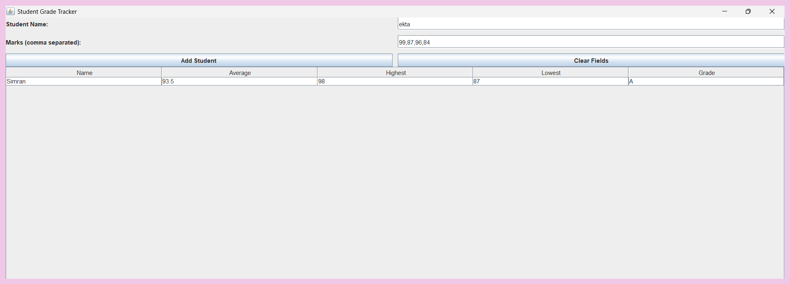
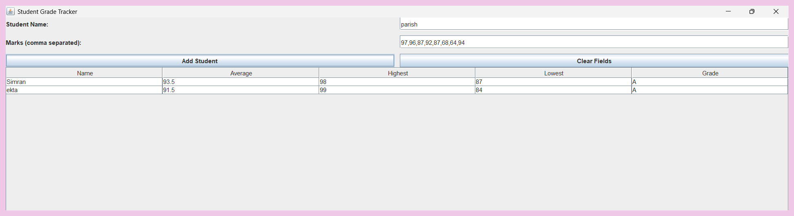
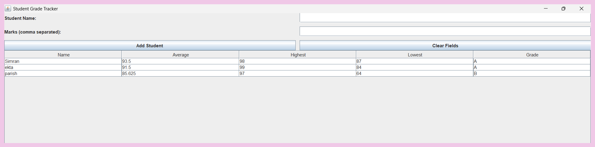

# 🎓 CodeAlpha Student Grade Tracker

A Java GUI-based application that allows users to input student marks and calculate average, highest, and lowest scores.

## 🚀 Features

- Add student name and marks
- Supports multiple subjects (comma separated input)
- Calculates average, highest, lowest
- Assigns grade (A/B/C/Fail)
- Displays data in table format
- Simple and user-friendly GUI
- 

## ▶️ How to Run

1. Compile:
javac CodeAlpha_StudentGradeTracker.java

2. Run:
java CodeAlpha_StudentGradeTracker

## 📸 Output

## 💡 Author

Simran Malhotra
